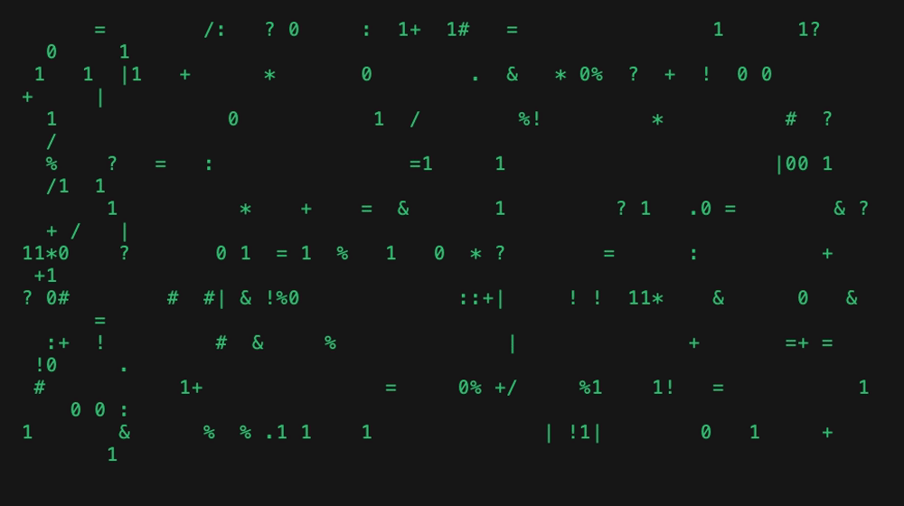

# ⌐■-■ **anderson** ⌐■-■

[](https://github.com/amj-lang/anderson/actions/workflows/ci.yml)
[](https://github.com/amj-lang/anderson/releases)
[](LICENSE)
[](https://github.com/amj-lang/anderson)



**Four Claude subagents that plan, grill, implement, and review each other — with two human gates, because green ≠ understood.**

**anderson** is a [Claude Code](https://claude.com/claude-code) plugin: a gated maker/checker pipeline that turns one task into a reviewed, shipped pull request. Each stage runs as its own subagent at its own model + effort, state lives on disk, and **two unconditional human gates** mean nothing merges without your eyes on it.

## Why

- **Roles, not one mega-prompt.** A planner plans, a separate reviewer critiques it, an implementer builds, an *independent* reviewer checks the diff. The maker never grades its own homework.
- **You stay in the loop.** Two human gates (after plan-review, after diff-review) halt unconditionally — even on a `ship` verdict. Plus an interactive **grill** step that interrogates the plan *before* any code is written.
- **Self-contained.** The agent logic is inlined — no external skills to install. Per-stage `model` + `effort` switch automatically.
- **Ships for real.** Approving the diff branches, commits, pushes, and opens the PR — guarded, so it degrades gracefully without a remote / `gh`. Runs headless in CI too.

## The pipeline

```
plan ─▶ grill ─▶ plan_review ──[ YOU ]──▶ implement ─▶ diff_review ──[ YOU ]──▶ ship
```

|     | Stage         | Persona                    | Model · effort  | Gate           | What happens |
|-----|---------------|----------------------------|-----------------|----------------|--------------|
| 🏛  | `plan`        | THE ARCHITECT              | opus · high     | —              | drafts `plan.md` |
| 🕶  | `grill`       | THE INTERROGATOR · *you*   | — (human)       | 🛑 human       | interrogates the plan one question at a time; your answers harden it |
| 🔮  | `plan_review` | THE ORACLE                 | opus · xhigh    | 🛑 **GATE 1**  | edits the plan + `## Diverged because`; verdict `ship` / `fix_first` / `regrill` |
| 🟢  | `implement`   | NEO                        | sonnet · medium | —              | writes the code + `audit.md` |
| 🕴  | `diff_review` | AGENT SMITH                | opus · xhigh    | 🛑 **GATE 2**  | independent, read-only diff review |
| 🔑  | `ship`        | THE ONE                    | —               | —              | branch `anderson/<slug>` + commit + push + PR, scratch cleaned |

`regrill` loops plan-review back to **grill**; `fix_first` loops the implementer (capped by `max_iterations`). Both gates halt unconditionally, even on a `ship` verdict.

## Quickstart

```
/plugin marketplace add amj-lang/anderson
/plugin install anderson@dodge-this
# restart Claude Code fully (not just /reload), then:
/anderson:start demo "build a live dashboard widget that pulls status from the top 5 AI companies' status pages"
```

Drive the gates in plain text — "approved, go" / "ship it" / "rework the blockers" — or with `/anderson:approve-plan`, `:approve-diff`, `:rework`, `:status`.

## Requirements

- [Claude Code](https://claude.com/claude-code) with plugin support.
- For the ship step: `git`, a remote, and the [`gh`](https://cli.github.com) CLI authenticated (degrades gracefully without them).

## Headless / CI

`plugins/anderson/bin/feature.sh` runs the same pipeline deterministically, exiting at each gate (codes 10/20) so it composes with CI or a Makefile — and `--approve-diff` ships the PR.

## More

- **Full operator docs** — models/effort verification, autonomous chaining, terminal flair, troubleshooting: **[plugins/anderson/README.md](plugins/anderson/README.md)**.
- Licensed under the [MIT License](LICENSE).
