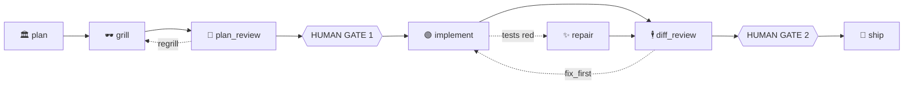

# ⌐■-■ **anderson** ⌐■-■

[](https://github.com/amj-lang/anderson/actions/workflows/ci.yml)
[](https://github.com/amj-lang/anderson/releases)
[](LICENSE)
[](https://github.com/amj-lang/anderson)
[](metrics/traffic.json)
[](metrics/installs.json)


A [Claude Code](https://claude.com/claude-code) plugin, Matrix themed, that spawns a crew of agents sized to the task and stops to make you resolve the ambiguity it cannot.

One task in, one reviewed pull request out.

## Why

- **Several features at once.** Each task is its own agent crew with its own state on disk, and `fleet` watches all of them from one terminal.
- **A higher one-shot success rate.** The plan gets grilled by you and torn apart by a second model before a line of code exists, so the implementation lands right the first time instead of on the third rework.
- **The human in the loop only where it counts.** Two gates, on the plan and on the diff. Everything between them runs without you.

## Philosophy


The job is changing. You will read less code and judge more intent.

Evaluate the plan and the design. Answer the ambiguity a model cannot resolve on its own. Then prove the result: scan what came out, run it, test it by hand.

That work does not need an IDE. It needs a terminal.

## Install & run

```
/plugin marketplace add amj-lang/anderson
/plugin install anderson@dodge-this
# restart Claude Code fully (not just /reload), then:
/anderson:start <slug> "<goal>"
```

`/anderson:demo` walks the whole pipeline for free: every banner, both gates, zero tokens.

For the multi-session monitor, run `/anderson:fleet` once, then type `fleet` in any terminal.

## How anderson works


```mermaid
flowchart LR
    plan[🏛 plan] --> grill[🕶 grill] --> pr[🔮 plan_review] --> g1{{HUMAN GATE 1}}
    g1 --> impl[🟢 implement] --> dr[🕴 diff_review] --> g2{{HUMAN GATE 2}} --> ship[🔑 ship]
    pr -. regrill .-> grill
    dr -. fix_first .-> impl
    impl -. tests red .-> rep[✨ repair]
    rep --> dr
```

|     | Stage         | Persona                  | Model · effort              |
| --- | ------------- | ------------------------ | --------------------------- |
| 🏛  | `plan`        | THE ARCHITECT            | opus · medium               |
| 🕶  | `grill`       | THE INTERROGATOR (you)   | human                       |
| 🔮  | `plan_review` | THE ORACLE               | opus · high\*, then GATE 1  |
| 🟢  | `implement`   | NEO                      | sonnet · medium             |
| ✨  | `repair`      | TRINITY (only when red)  | opus · high                 |
| 🛡  | `diff_review` | SERAPH · NIOBE · THE MEROVINGIAN (crew, when the diff calls them) | security · performance · dead-code lens seats |
| 🕴  | `diff_review` | AGENT SMITH              | opus · high\*, then GATE 2  |
| 🔑  | `ship`        | THE ONE                  | branch + commit + push + PR |

The grill interrogates the plan one question at a time before any code exists. `regrill` sends the plan reviewer's doubts back to the grill; `fix_first` loops the implementer, capped by `max_iterations`.

The crew is summoned by what the diff touches, not by a model: `bin/crew.py` seats SERAPH for auth, API, input handling, secrets and dependencies (always from HARD up), NIOBE for queries, loops over I/O and React effects, and THE MEROVINGIAN whenever the diff changes existing code, to catch what it orphaned. They review blind into their own files; AGENT SMITH rules on their findings.

A red test suite does not loop the implementer. It gets one try; if the tests are still red, `repair` hands them to TRINITY on opus/high, which root-causes the failure and may never weaken, skip or delete a test to get green.

Each gate shows you a TL;DR card: what changes, how many criteria and of which proof type, the scorecard, the verdict. You open the full plan only when a line raises doubt. Both gates halt unconditionally.

## auto mode

`/anderson:auto <task-id> <title> [body|@file]` runs the same pipeline with no human halts and ends at a **draft** PR. Experimental.

The two human gates are replaced by three things, in order. An objective **CI veto** runs first: a red build fails the gate before a single reviewer token is spent. Then a tier-sized **blind reviewer panel** (1, 2 or 3 reviewers in parallel, each on one lens, blind to the implementer's `audit.md` and to each other). Then an **opus arbiter** that resolves on merit, not headcount.

Two hard rules never bend: auto never authors or applies a migration, and never force-pushes any branch but its own `anderson/auto/*`.

Everything else (stage table, gate matrix, override policy, open-questions handling) is in [plugins/anderson/README.md](plugins/anderson/README.md) and the spec at [plugins/anderson/docs/auto-mode.md](plugins/anderson/docs/auto-mode.md).

## The paper trail

Everything for one task lives in `feature-research/<task>/`:

```
feature-research/<task>/
├── plan.md            the human-facing artifact
├── state.md           machine state: stage, gate, verdicts, tier
├── audit.md           implementer's evidence, one entry per criterion
├── design/            normalized Figma shots / ticket screenshots / images
│   └── inventory.md   exact strings, states, layout facts
└── report.md          auto mode only, written on abort
```

**`plan.md`** reads What → Why → ⚠️ Behavior change → 🗺 Design → ✅ Acceptance criteria → How → 📈 Scorecard, heavy sections folded in `<details>`. Its spine is the **✅ Acceptance criteria** table (`# | Criterion | Source | Proof | Evidence`). Criteria come from the ticket verbatim, from the design inventory, or are `derived` (the grill confirms those). Each names its proof: `test` (must fail without the change), `visual` (screenshot vs the design), `e2e` (ephemeral, deleted at ship) or `manual` (last resort). The implementer fills Evidence; the diff reviewer blocks on a blank cell. It also carries 💥 Blast radius, 🧯 Error handling, a 7-dimension 📈 Scorecard, and 🔭 Review, where both reviewers append.

**`state.md`** is machine-only: current stage, gate, iteration vs `max_iterations`, both verdicts, tier. It is what makes a run resumable and what `/anderson:status` and `fleet` read.

## Difficulty tiers

A tier (trivial / normal / hard / critical) is derived from the plan's Scorecard (Risk, Coupling, Confidence, Testability) and re-derived from the actual diff size at the gate. It only escalates, so a one-line fix never pays for a 3-agent panel. A forbidden or dependency-path hit pins the tier to critical.

| Tier     | Plan gate     | Diff critique / arbiter | auto panel        |
| -------- | ------------- | ----------------------- | ----------------- |
| trivial  | opus · high   | opus · high             | 1 × sonnet · high |
| normal   | opus · high   | opus · high             | 2 × sonnet · high |
| hard     | opus · high   | opus · xhigh            | 3 × opus · high   |
| critical | opus · xhigh  | opus · xhigh            | 3 × opus · high   |

\* Effort by tier, per the table above. The plan critique always runs a rung above the opus/medium planner. In auto, the arbiter backstops every panel outcome except a unanimous refute; repair stays opus · high on every tier.

## Why Opus 5.5

Up to 0.52, both review gates ran on Fable. Against Opus 5 that was the right call: Fable scored higher on fewer tokens, so the higher per-token price paid for itself. Opus 5.5 flipped it. It beats Fable 5.1 on every benchmark Anthropic published at launch, and it costs 2.5× less per token. So since 0.53.0 every critique seat runs on Opus, and the `--opus` flag is gone.

| Benchmark (Anthropic, launch) | Measures | Opus 5.5 | Fable 5.1 |
| --- | --- | --- | --- |
| Terminal-Bench 4.0 | agentic coding in a terminal | **66.4%** | 55.8% |
| CursorBench 4.0 | agentic coding in an editor | **57.8%** | 51.8% |
| FrontierCode v1.1 | agentic coding | **54.4%** | 50.3% |
| AutomationBench | multi-step automation | **40.0%** | 31.4% |
| GDPval-AA v2.1 | knowledge work (Elo) | **1846** | 1735 |
| Humanity's Last Exam | multidisciplinary reasoning | **67.7%** | 65.6% |
| OSWorld 2.0 | computer use | **81.8%** | 80.7% |
| Price per token | | **2.5× cheaper** | |

What moved in 0.53.0:

- **Planner:** opus · high → opus · medium. Opus 5.5 at medium beats Opus 5 at high.
- **Plan review:** fable → opus · high on every tier (trivial no longer skips it), opus · xhigh at critical. It always runs a rung above the planner.
- **Diff review and auto arbiter:** fable → opus · high, opus · xhigh from hard up.
- **auto hard/critical panel:** fable · xhigh → opus · high, a rung under the arbiter.
- **Removed:** the `--opus` flag and the `review_model` state field. The tier alone sizes the effort.
- **Unchanged:** implementer on sonnet · medium, repair on opus · high.

The honest caveat, in Anthropic's words: "the gap between Opus 5.5 and Claude Fable 5.1 is narrower than these scores suggest." There is also no public head-to-head on code review, which is what these gates actually do. It doesn't change the call: a model that only matched Fable at 40% of the price would still win the seat. Full rules and tables in [docs/tiering.md](plugins/anderson/docs/tiering.md).

## Fleet: every Claude session on one screen


A zero-token python curses terminal that runs outside Claude. One row per Claude Code session on the machine, ringing rows first.

| Key         | Does                                            |
| ----------- | ----------------------------------------------- |
| `1`-`9`, `⏎` | jack into that session's pane, or spawn an agent into a repo row |
| `w`         | jump to the oldest session waiting on you        |
| `o`         | read the plan or audit right there              |
| `n`         | desktop notification when a session rings       |
| `m` / `s`   | ring sound on/off, next ring sound              |
| `r`         | kill the session (asks first)                   |
| `R`         | rebase this checkout onto main/master, force-push that branch (asks first) |
| `/`         | filter                                          |
| `?`         | manual                                          |

- Personas come from each repo's `feature-research/*/state.md`, so you see who is on the job across repos.
- `⏎` on a dead session (`✝ sentinel`) revives it in a new window already running `claude --resume`.
- `→` drills into a repo; with no agents in it, `⏎` still spawns one there.
- `R` is the only force push fleet performs: `--force-with-lease`, on the branch it just rebased, never the base. It refuses on a dirty tree, on main/master itself, and when GitHub does not report the base branch as protected. Conflicts abort and stay yours.
- The header shows your `/usage` windows as bars.
- Needs nothing but python3. `glow`, `terminal-notifier` and `tmux` are optional.

```
/anderson:fleet      # once: installs ~/.local/bin/fleet
fleet                # outside tmux: attaches a per-workspace tmux session; inside: right here
fleet --here         # always right here, tmux or not
fleet --pane         # 45% tmux side pane
fleet --demo         # four fake rows to try it
```

Full flags, data sources and themes: [plugins/anderson/README.md → Extras](plugins/anderson/README.md#extras-terminal).

## Commands

| Command        | Does                                                              |
| -------------- | ----------------------------------------------------------------- |
| `start`        | Plan, grill you, plan-review. Halts at Gate 1.                    |
| `approve-plan` | Implement, then independent diff review. Halts at Gate 2.         |
| `approve-diff` | Ship: branch, commit, push, PR. Never force-pushes.               |
| `rework`       | Loop the implementer on the blockers, re-review. Back to Gate 2.  |
| `status`       | Where a run is: stage, next agent, verdicts, iteration.           |
| `demo`         | Zero-token dry run of every banner and both gates.                |
| `auto`         | Non-halting pipeline to a draft PR. Experimental.                 |
| `help`         | Quick-reference card. Reads nothing.                              |
| `fleet`        | Install the `fleet` terminal command.                             |

Commands are namespaced `/anderson:<command>` and take positional args (first word is the slug, the state-dir key). Once a flow is running you can also just say "approved, go", "ship it" or "rework the blockers" in plain text.

## Requirements

- Claude Code with plugin support.
- For ship: `git`, a remote, and an authenticated [`gh`](https://cli.github.com). Degrades gracefully without them.

## More

- Full operator docs: [plugins/anderson/README.md](plugins/anderson/README.md)
- auto-mode spec: [plugins/anderson/docs/auto-mode.md](plugins/anderson/docs/auto-mode.md)
- Headless / CI runner: [plugins/anderson/bin/feature.sh](plugins/anderson/bin/feature.sh) exits 10 at Gate 1 and 20 at Gate 2, so it composes with CI or a Makefile
- Promo video source and README images: the [`media`](https://github.com/amj-lang/anderson/tree/media) branch (`git switch media`). Off `main` so installing the plugin does not download them.
- CI workflow: [.github/workflows/ci.yml](.github/workflows/ci.yml)
- Install counting, and how to switch it off: [plugins/anderson/README.md#install-counting](plugins/anderson/README.md#install-counting)
- [MIT licence](LICENSE)
