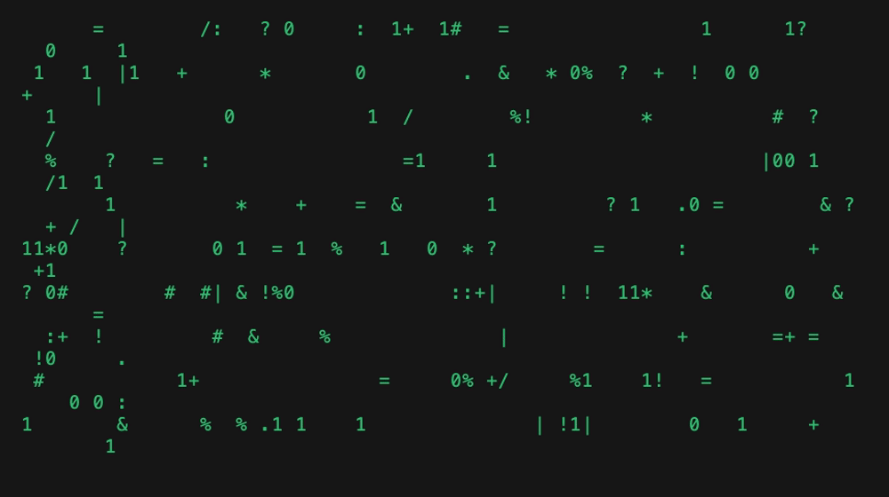
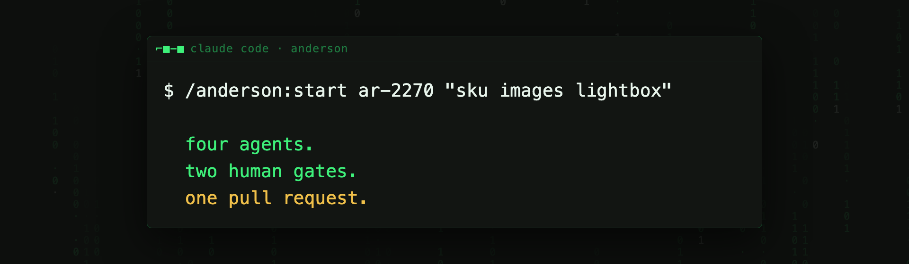

# ⌐■-■ **anderson** ⌐■-■

[](https://github.com/amj-lang/anderson/actions/workflows/ci.yml)
[](https://github.com/amj-lang/anderson/releases)
[](LICENSE)
[](https://github.com/amj-lang/anderson)



A [Claude Code](https://claude.com/claude-code) plugin. Four subagents (planner, plan reviewer, implementer, independent diff reviewer) plan, grill, build and review each other's work, then stop at two human gates before anything ships.

One task in, one reviewed pull request out.



## Why


- **The maker never grades its own homework.** Separate reviewer roles with fresh context, not one mega-prompt that plans, codes and approves itself.
- **Two human gates halt even on a `ship` verdict.** Green is not the same as understood.
- **Each stage runs at its own model and effort.** A one-line fix does not pay opus prices.
- **State lives on disk.** Stop at a gate, come back days later, resume where you left off.

## Install & run

```
/plugin marketplace add amj-lang/anderson
/plugin install anderson@dodge-this
# restart Claude Code fully (not just /reload), then:
/anderson:start <slug> "<goal>"
```

`/anderson:demo` walks the whole pipeline for free: every banner, both gates, zero tokens.

For the multi-session monitor, run `/anderson:fleet` once, then type `fleet` in any terminal.

## How anderson works


```mermaid
flowchart LR
    plan[🏛 plan] --> grill[🕶 grill] --> pr[🔮 plan_review] --> g1{{HUMAN GATE 1}}
    g1 --> impl[🟢 implement] --> dr[🕴 diff_review] --> g2{{HUMAN GATE 2}} --> ship[🔑 ship]
    pr -. regrill .-> grill
    dr -. fix_first .-> impl
```

|     | Stage         | Persona                  | Model · effort              |
| --- | ------------- | ------------------------ | --------------------------- |
| 🏛  | `plan`        | THE ARCHITECT            | opus · high                 |
| 🕶  | `grill`       | THE INTERROGATOR (you)   | human                       |
| 🔮  | `plan_review` | THE ORACLE               | fable · xhigh, then GATE 1  |
| 🟢  | `implement`   | NEO                      | sonnet · medium             |
| 🕴  | `diff_review` | AGENT SMITH              | fable · high, then GATE 2   |
| 🔑  | `ship`        | THE ONE                  | branch + commit + push + PR |

The grill interrogates the plan one question at a time before any code exists. `regrill` sends the plan reviewer's doubts back to the grill; `fix_first` loops the implementer, capped by `max_iterations`.

Each gate shows you a TL;DR card: what changes, how many criteria and of which proof type, the scorecard, the verdict. You open the full plan only when a line raises doubt. Both gates halt unconditionally.

## auto mode

`/anderson:auto <task-id> <title> [body|@file]` runs the same pipeline with no human halts and ends at a **draft** PR. Experimental.

The two human gates are replaced by three things, in order. An objective **CI veto** runs first: a red build fails the gate before a single reviewer token is spent. Then a tier-sized **blind reviewer panel** (1, 2 or 3 reviewers in parallel, each on one lens, blind to the implementer's `audit.md` and to each other). Then a **fable arbiter** that resolves on merit, not headcount.

Two hard rules never bend: auto never authors or applies a migration, and never force-pushes any branch but its own `anderson/auto/*`.

Everything else (stage table, gate matrix, override policy, open-questions handling) is in [plugins/anderson/README.md](plugins/anderson/README.md) and the spec at [plugins/anderson/docs/auto-mode.md](plugins/anderson/docs/auto-mode.md).

## The paper trail

Everything for one task lives in `feature-research/<task>/`:

```
feature-research/<task>/
├── plan.md            the human-facing artifact
├── state.md           machine state: stage, gate, verdicts, tier
├── audit.md           implementer's evidence, one entry per criterion
├── design/            normalized Figma shots / ticket screenshots / images
│   └── inventory.md   exact strings, states, layout facts
└── report.md          auto mode only, written on abort
```

**`plan.md`** reads What → Why → ⚠️ Behavior change → 🗺 Design → ✅ Acceptance criteria → How → 📈 Scorecard, heavy sections folded in `<details>`. Its spine is the **✅ Acceptance criteria** table (`# | Criterion | Source | Proof | Evidence`). Criteria come from the ticket verbatim, from the design inventory, or are `derived` (the grill confirms those). Each names its proof: `test` (must fail without the change), `visual` (screenshot vs the design), `e2e` (ephemeral, deleted at ship) or `manual` (last resort). The implementer fills Evidence; the diff reviewer blocks on a blank cell. It also carries 💥 Blast radius, 🧯 Error handling, a 7-dimension 📈 Scorecard, and 🔭 Review, where both reviewers append.

**`state.md`** is machine-only: current stage, gate, iteration vs `max_iterations`, both verdicts, `review_model`, tier. It is what makes a run resumable and what `/anderson:status` and `fleet` read.

## Difficulty tiers

A tier (trivial / normal / hard / critical) is derived from the plan's Scorecard (Risk, Coupling, Confidence, Testability) and re-derived from the actual diff size at the gate. It only escalates, so a one-line fix never pays for a 3-agent panel. A forbidden or dependency-path hit pins the tier to critical.

| Tier     | Plan gate       | Diff critique (`start`) | auto panel     |
| -------- | --------------- | ----------------------- | -------------- |
| trivial  | skipped         | fable · medium          | 1 × sonnet     |
| normal   | fable · high    | fable · medium          | 2 × sonnet     |
| hard     | fable · xhigh   | fable · high            | 3 × fable      |
| critical | fable · xhigh   | fable · xhigh           | 3 × fable      |

In auto, a fable arbiter backstops every panel outcome except a unanimous refute.

Fable is the default critic on both review gates. `--opus` on `start` or `auto` puts them back on Opus; the generative stages (planner on opus, implementer on sonnet) are never touched by the flag.

## Fleet: every Claude session on one screen


A zero-token python curses terminal that runs outside Claude. One row per Claude Code session on the machine, ringing rows first.

| Key         | Does                                            |
| ----------- | ----------------------------------------------- |
| `1`-`9`, `⏎` | jack into that session's pane                  |
| `w`         | jump to the oldest session waiting on you        |
| `o`         | read the plan or audit right there              |
| `n`         | desktop notification when a session rings       |
| `m` / `s`   | ring sound on/off, next ring sound              |
| `r`         | kill the session (asks first)                   |
| `/`         | filter                                          |
| `?`         | manual                                          |

- Personas come from each repo's `feature-research/*/state.md`, so you see who is on the job across repos.
- `⏎` on a dead session (`✝ sentinel`) revives it in a new window already running `claude --resume`.
- The header shows your `/usage` windows as bars.
- Needs nothing but python3. `glow`, `terminal-notifier` and `tmux` are optional.

```
/anderson:fleet      # once: installs ~/.local/bin/fleet
fleet                # run it here, tmux or not
fleet --pane         # 45% tmux side pane
fleet --demo         # four fake rows to try it
```

Full flags, data sources and themes: [plugins/anderson/README.md → Extras](plugins/anderson/README.md#extras-terminal).

## Commands

| Command        | Does                                                              |
| -------------- | ----------------------------------------------------------------- |
| `start`        | Plan, grill you, plan-review. Halts at Gate 1.                    |
| `approve-plan` | Implement, then independent diff review. Halts at Gate 2.         |
| `approve-diff` | Ship: branch, commit, push, PR. Never force-pushes.               |
| `rework`       | Loop the implementer on the blockers, re-review. Back to Gate 2.  |
| `status`       | Where a run is: stage, next agent, verdicts, iteration.           |
| `demo`         | Zero-token dry run of every banner and both gates.                |
| `auto`         | Non-halting pipeline to a draft PR. Experimental.                 |
| `help`         | Quick-reference card. Reads nothing.                              |
| `fleet`        | Install the `fleet` terminal command.                             |

Commands are namespaced `/anderson:<command>` and take positional args (first word is the slug, the state-dir key). Once a flow is running you can also just say "approved, go", "ship it" or "rework the blockers" in plain text.

## Requirements

- Claude Code with plugin support.
- For ship: `git`, a remote, and an authenticated [`gh`](https://cli.github.com). Degrades gracefully without them.

## More

- Full operator docs: [plugins/anderson/README.md](plugins/anderson/README.md)
- auto-mode spec: [plugins/anderson/docs/auto-mode.md](plugins/anderson/docs/auto-mode.md)
- Headless / CI runner: [plugins/anderson/bin/feature.sh](plugins/anderson/bin/feature.sh) exits 10 at Gate 1 and 20 at Gate 2, so it composes with CI or a Makefile
- Promo video source: [video/](video/) (Remotion, `npm run render`)
- CI workflow: [.github/workflows/ci.yml](.github/workflows/ci.yml)
- [MIT licence](LICENSE)
