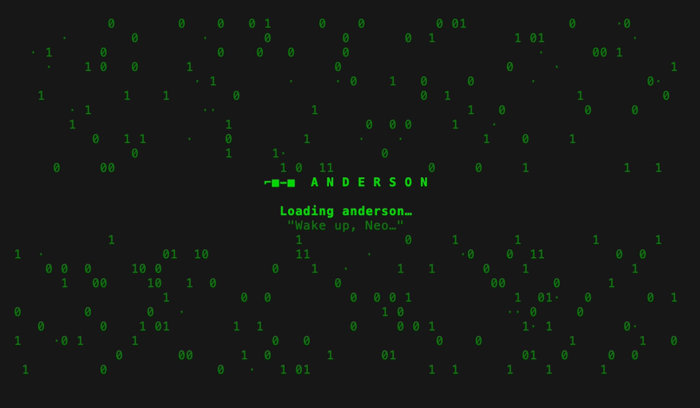
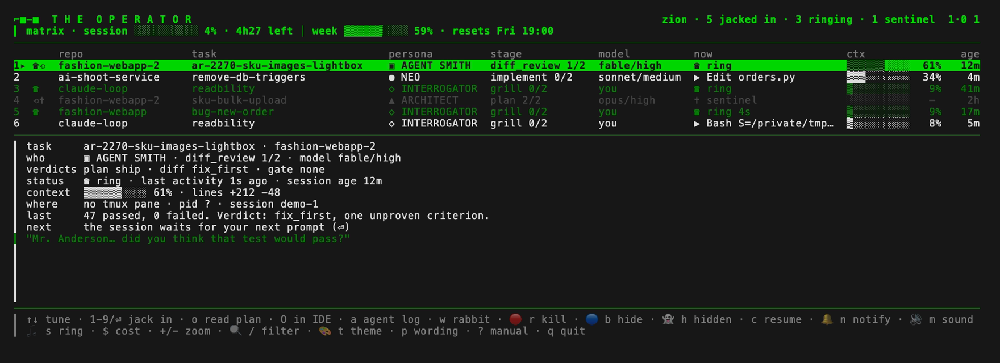

# ⌐■-■ **anderson** ⌐■-■

[](https://github.com/amj-lang/anderson/actions/workflows/ci.yml)
[](https://github.com/amj-lang/anderson/releases)
[](LICENSE)
[](https://github.com/amj-lang/anderson)



*The fleet terminal booting. What it opens onto is [further down](#fleet--every-claude-session-on-one-screen).*

**Four Claude subagents that plan, grill, implement, and review each other — with two human gates, because green ≠ understood.**

**anderson** is a [Claude Code](https://claude.com/claude-code) plugin: a gated maker/checker pipeline that turns one task into a reviewed, shipped pull request. Each stage runs as its own subagent at its own model + effort, state lives on disk, and **two unconditional human gates** mean nothing merges without your eyes on it.

## Why

- **Roles, not one mega-prompt.** A planner plans, a separate reviewer critiques it, an implementer builds, an *independent* reviewer checks the diff. The maker never grades its own homework.
- **You stay in the loop.** Two human gates (after plan-review, after diff-review) halt unconditionally — even on a `ship` verdict. Plus an interactive **grill** step that interrogates the plan *before* any code is written.
- **Self-contained.** The agent logic is inlined — no external skills to install. Per-stage `model` + `effort` switch automatically.
- **Ships for real.** Approving the diff branches, commits, pushes, and opens the PR — guarded, so it degrades gracefully without a remote / `gh`. Runs headless in CI too.

## The pipeline

```
plan ─▶ grill ─▶ plan_review ──[ YOU ]──▶ implement ─▶ diff_review ──[ YOU ]──▶ ship
```

|     | Stage         | Persona                  | Model · effort  | Gate          | What happens                                                                                       |
| --- | ------------- | ------------------------ | --------------- | ------------- | -------------------------------------------------------------------------------------------------- |
| 🏛  | `plan`        | THE ARCHITECT            | opus · high     | —             | drafts `plan.md`                                                                                   |
| 🕶  | `grill`       | THE INTERROGATOR · *you* | — (human)       | 🛑 human      | interrogates the plan one question at a time; your answers harden it                               |
| 🔮  | `plan_review` | THE ORACLE               | fable · xhigh   | 🛑 **GATE 1** | edits the plan inline + appends review to `## 🔭 Review`; verdict `ship` / `fix_first` / `regrill` |
| 🟢  | `implement`   | NEO                      | sonnet · medium | —             | writes the code + `audit.md`, files evidence per acceptance criterion                              |
| 🕴  | `diff_review` | AGENT SMITH              | fable · high    | 🛑 **GATE 2** | independent, read-only diff review; blocks on any unproven criterion                               |
| 🔑  | `ship`        | THE ONE                  | —               | —             | branch `anderson/<slug>` + commit + push + PR, scratch cleaned                                     |

`regrill` loops plan-review back to **grill**; `fix_first` loops the implementer (capped by `max_iterations`). Both gates halt unconditionally, even on a `ship` verdict — on a TL;DR card (what · criteria/proof counts · scorecard · verdict), so you open the full plan only when a line raises doubt.

Every plan is spined by an **✅ Acceptance criteria** table — criteria lifted verbatim from the ticket, extracted from the design (an intake step normalizes Figma URLs / ticket screenshots / image files into scratch + an exact-strings inventory), or `derived` (the grill confirms those). Each criterion names its proof: a **test** that fails without the change, a **visual** screenshot compared against the design, an **ephemeral e2e** (gate-time only, deleted at ship, promotable), or **manual** steps as the last resort. The implementer files the evidence; the diff review proves it or blocks.

## auto mode — the autonomous pipeline

`/anderson:auto <task-id> <title> [body|@taskspec-file]` runs the **same four subagents end-to-end with no human halts**. The two interactive gates are replaced by independent adversarial agent panels plus an objective CI gate; it produces a **draft PR** for you to merge. Experimental — review the PR carefully.

```
ingest ─▶ baseline ─▶ plan ─▶ plan-gate ─▶ RED ─▶ implement ─▶ diff-gate ──▶ ship ─▶ report
 lock      green       opus    1 reviewer   freeze   sonnet     CI+panel+      draft    metrics
           tree                (skip triv)  test              arbiter        PR
                                                     ▲              │ rework (bounded)
                                                     └──────────────┘
```

|     | Stage       | Persona       | Model · effort                                   | What happens                                                                                                                    |
| --- | ----------- | ------------- | ------------------------------------------------ | ------------------------------------------------------------------------------------------------------------------------------- |
| 📥  | `ingest`    | THE OPERATOR  | —                                                | normalize the TaskSpec, derive acceptance criteria, acquire a run-lock on `task-id`                                             |
| 🛡  | `baseline`  | THE GUARDIAN  | —                                                | `git fetch`, isolate a worktree, cut a branch, run the suite — **must be green** (red baseline → abort)                         |
| 🏛  | `plan`      | THE ARCHITECT | opus · high                                      | draft `plan.md`; confidence gate; route a difficulty **tier** (trivial/normal/hard/critical)                                    |
| 🔮  | `plan-gate` | THE ORACLE    | fable · xhigh                                    | criteria-coverage check + **one** plan-reviewer (skipped on a trivial tier)                                                     |
| 🧪  | `RED`       | THE SABOTEUR  | —                                                | write a failing test for the criteria, confirm it fails on an **assertion** (not a load error), then content-hash **freeze** it |
| 🟢  | `implement` | NEO           | sonnet · medium                                  | make the red test green + `audit.md`; implementer self-reviews first                                                            |
| 🕴  | `diff-gate` | AGENT SMITH   | panel sonnet·high / fable·xhigh · arbiter fable·xhigh | **CI veto** (red build short-circuits) → tier-sized **blind panel** (1/2/3) → **fable arbiter** backstop                         |
| 🔑  | `ship`      | THE ONE       | —                                                | squash to one clean commit, push the branch, open a **draft** PR (never auto-merge)                                             |
| 📨  | `report`    | THE MESSENGER | —                                                | structured terminal result + a machine-greppable `metrics:` line                                                                |

**What replaces the two human gates** — never self-approval (the maker never grades its own homework):

| Replaces                | Mechanism                                                                                               | Model · effort                                                 | Directive                                                                                                                            |
| ----------------------- | ------------------------------------------------------------------------------------------------------- | -------------------------------------------------------------- | ------------------------------------------------------------------------------------------------------------------------------------ |
| *both gates, objective* | **CI veto** — GitHub Actions run, or the in-tree suite as fallback                                      | —                                                              | runs FIRST; a red build/suite fails the gate **before a single reviewer token is spent**                                             |
| **plan gate**           | criteria check + **one plan-reviewer** (skip trivial)                                                   | fable · xhigh                                                  | refute the plan; map every criterion to a step; default reject                                                                       |
| **diff gate**           | **tier-sized blind panel** — 1/2/3 reviewers, parallel                                                  | **sonnet · high** (trivial/normal) · **fable · xhigh** (hard/critical)| each judges ONE lens — correctness · regressions+security · plan-match — from the diff+plan only, blind to `audit.md` and each other |
| **diff arbiter**        | **one reviewer**, runs on every split **and** every unanimous ship (skipped only on a unanimous refute) | fable · xhigh                                                  | resolve on merit, not headcount; on a clean ship, re-review rather than rubber-stamp; forced `## Options considered` (+/−) table     |

Plus:

- **Override policy (operator opt-in).** auto pushes through the soft guardrails to *finish the task* (low planner confidence, scope/runaway caps, sensitive non-migration paths). **Two hard rules never bend:** it **never authors or applies a migration** (hard stop + hand-off) and **never force-pushes any branch but its own** `anderson/auto/*` (squash-to-clean on its own branch only).
- **Difficulty routing.** A tier from the plan's Scorecard, re-derived from the actual diff size (escalate-only), sizes the plan gate, the panel size, the panel model, and the arbiter — so a one-line fix doesn't pay for a 3-opus panel.
- **Verification hardening.** RED red-for-right-reason, content-hash tamper guard, full-suite-no-new-failures vs baseline, flake re-runs, and blind reviewers.
- **Error handling & open questions.** The plan enumerates the failure paths the change touches and classes each `deduced` (handle it now) or `needs-context` (a business call the code can't make). With no human to grill, auto captures the `needs-context` ones into a **## ❓ Open questions & assumptions** PR section, flags the PR `needs-human`, and adds `open_q=<n>` to the `metrics:` line — it ships the question, never an invented answer.
- **Safety rails.** Draft PR only; branch only (its own worktree is the sandbox); baseline-green precondition; dependency/secret-path edits flagged `needs-human`.
- **Terminal states.** SHIP (`stage: done`, draft PR opened) or abort (`stage: aborted` + a structured `feature-research/<task-id>/report.md`).

Full operator detail: **[plugins/anderson/README.md](plugins/anderson/README.md)** (auto mode) and the spec at **[plugins/anderson/docs/auto-mode.md](plugins/anderson/docs/auto-mode.md)**.

## Quickstart

```
/plugin marketplace add amj-lang/anderson
/plugin install anderson@dodge-this
# restart Claude Code fully (not just /reload), then:
/anderson:start demo "build a live dashboard widget that pulls status from the top 5 AI companies' status pages"
```

Drive the gates in plain text — "approved, go" / "ship it" / "rework the blockers" — or with `/anderson:approve-plan`, `:approve-diff`, `:rework`, `:status`. Run `/anderson:demo` for a zero-token dry-run of the full pipeline.

## Commands

All commands are namespaced `/anderson:<command>` — bare `/anderson` does not resolve. They take **positional arguments** — the first word is the `<slug>` / `<task-id>` (the on-disk state-dir key), the rest is the goal/title — plus one optional flag: **`--fable`** on `start` / `auto` (place it at the end). It runs the two critique gates (plan-review + diff-review/arbiter) on **Fable** instead of Opus — the stronger critical analyst — while the generative stages (planner, implementer) stay on Opus/Sonnet. The choice persists in `state.md`, so it carries across `approve-plan` / `rework`. A slug with a `/` (a pasted Linear branch name like `user/ar-2587-ui-polish`) is fine: the state dir is the last segment (`feature-research/ar-2587-ui-polish/`, always flat) and ship uses the full slug as the branch name. Every command just reads the same `feature-research/<slug>/state.md`, so once a flow is running you can also drive it in plain text ("approved, go" / "ship it" / "rework the blockers").

| Command        | Invoke                                           | What it does                                                                                                                                                               | When to use                                            |
| -------------- | ------------------------------------------------ | -------------------------------------------------------------------------------------------------------------------------------------------------------------------------- | ------------------------------------------------------ |
| `start`        | `/anderson:start <slug> <goal> [--opus]`         | **Entry point** (gated). Normalizes ticket/design refs into scratch, seeds state, plans, **grills you** one question at a time, plan-reviews. Halts at 🛑 Gate 1. `--fable` → review gates on Fable.                    | Begin any gated task.                                  |
| `approve-plan` | `/anderson:approve-plan <slug>`                  | Pass Gate 1 → implement + independent diff-review. Halts at 🛑 Gate 2.                                                                                                     | After you've read `plan.md` + `## 🔭 Review`.          |
| `approve-diff` | `/anderson:approve-diff <slug>`                  | Pass Gate 2 = **SHIP**: branch + commit + push + PR (all guarded), clean scratch. Never force-pushes.                                                                      | After you've read the diff + review.                   |
| `rework`       | `/anderson:rework <slug>`                        | Loop the implementer on the "Still open" blockers only, then re-review. Back to Gate 2. Bounded by `max_iterations`.                                                       | Diff review returned `fix_first`.                      |
| `status`       | `/anderson:status <slug>`                        | Dashboard: stage, next agent + model/effort, both verdicts, iteration vs max, model-override check. Read-only.                                                             | Check where a run is, or resume later.                 |
| `demo`         | `/anderson:demo`                                 | Zero-token dry-run: prints every stage banner + both gate lines. No agents, no files.                                                                                      | Preview the UX before a real run.                      |
| `auto`         | `/anderson:auto <task-id> <title> [body\|@file] [--opus]` | **Autonomous** end-to-end → draft PR, no human gates (see [auto mode](#auto-mode--the-autonomous-pipeline)). `body` is optional inline text or `@path` to a TaskSpec file; `--fable` → review gates on Fable. | Well-scoped, unattended fixes you'll review at the PR. |
| `help`         | `/anderson:help`                                 | Static quick-reference card: every command, arguments, gates, `--opus`. Reads nothing, spends no agent tokens.                                                            | Forgot an invocation or what `--fable` does.           |
| `fleet`        | `/anderson:fleet`                                | Installs the **`fleet`** terminal command (THE OPERATOR — see [Fleet](#fleet--every-claude-session-on-one-screen)) and prints its launch card. Idempotent, no agents.   | Once per machine; then type `fleet` in any terminal.   |

**Our suggestions.** First-timers: run `/anderson:demo` to see the whole flow for free. For everyday work drive the gated loop `start → approve-plan → approve-diff` (with `rework` between gates as needed) — the two human gates are the point. Reach for `auto` only when the task is well-scoped **and** the suite is green; always review its draft PR. For CI / walk-away runs use the flag-driven headless runner `bin/feature.sh` (`start` / `--approve-plan` / `--approve-diff` / `--rework`) — see [Headless / CI](#headless--ci).

## Fleet — every Claude session on one screen

You run anderson in several repos at once. **THE OPERATOR** is the terminal that watches them all: one row per Claude Code session on the machine, ringing rows first.



- **Who is on the job**: the persona comes from that repo's `feature-research/*/state.md` — ▲ ARCHITECT · ◇ INTERROGATOR · ◎ ORACLE · ● NEO · ▣ AGENT SMITH · ★ THE ONE · ○ T. ANDERSON (a session with no pipeline yet).
- **What it is doing**: `▶ Bash pytest -q`, `▶ Agent implementer`, `☎ ring` (waits on you), `☎ permission Bash`, `✝ sentinel` (process gone), `⟲` (rework loop). Plus `$`, context bar, lines ±, age, last words.
- **Jack in**: `1`..`9` or `⏎` switches tmux to that session's pane; without tmux, on macOS it focuses the iTerm2 / Terminal.app tab that owns the session, or brings the owning IDE forward for integrated terminals. `w` jumps to the oldest one waiting. `r` kills (asks first) and hides the row. `b` hides any row without touching the process. `c` copies the `claude --resume` command to bring it back. `o` reads the plan or audit right there in the fleet terminal (`q` returns); `O` opens it in your IDE, automatically when `⏎` lands on a human gate **and an IDE actually owns that session** (a plain-terminal session just gets jacked into, no IDE complaint). `n` pings you with a desktop notification when a session starts waiting or crosses 80% context. `m` makes it ring: the Matrix phone by default, `s` cycles seven bundled sounds (snare, hitech, freeze, blip, rift, jump…) or any `.wav` you drop in `~/.claude/fleet/sounds/`. `/` filters. `?` manual.
- **Readable at a glance**: a labelled detail card for the selected session (task, who, verdicts, status, context, where, last words, and **next**: the one thing you do now) when the terminal has room; rows are numbered; sessions with no pipeline show their first prompt as the title; ringing rows say for how long (`☎ ring 12m`); the context cell turns red past 80%.
- **Needs almost nothing**: python3 and what the OS ships. Optional, and `fleet install` says which are missing: `glow` (`o` renders the plan as markdown), `terminal-notifier` (macOS banners), `tmux` (panes). `/anderson:fleet --extras` installs the first two, `--with-tmux` the third, `--all` everything. Table: [What fleet needs](plugins/anderson/README.md#what-fleet-needs).
- **Usage at a glance**: the header shows your `/usage` windows with bars: `session ▓▓▓▓░░░░░░ 42% · 3h39 left │ week ▓▓▓▓▓░░░░░ 52% · resets Fri 19:00`. On a flat-fee plan those percentages are the cost; the API-price estimate per session is hidden (`$` or `--cost` shows it as a burn gauge). API-key users see the estimate by default.
- **Zero tokens**: plain python curses, runs **outside** Claude. Sessions are found with no setup (`ps` + transcripts). The plugin's hooks add the exact waiting/working signal; the statusline heartbeat adds `$` and precise context (wrap any statusline with `bin/fleet-statusline.sh`).
- **Your look, remembered**: five themes (`matrix`, `construct`, `zion`, `nebuchadnezzar`, `agent`) with `t`, Matrix or plain wording with `p`, `--calm` for no motion — all saved in `~/.claude/fleet/prefs.json`. Boot screen rotates a line every launch; `--no-intro` skips it.

```
/anderson:fleet            # once: installs ~/.local/bin/fleet (survives plugin updates)
fleet                      # runs right here, tmux or not · --tmux: persistent tmux session
fleet --pane               # 45% side pane        fleet --demo    # four fake rows to try it
```

Full flags, data sources and theme table: [plugins/anderson/README.md → Extras](plugins/anderson/README.md#extras-terminal).

## Requirements

- [Claude Code](https://claude.com/claude-code) with plugin support.
- For the ship step: `git`, a remote, and the [`gh`](https://cli.github.com) CLI authenticated (degrades gracefully without them).

## Headless / CI

`plugins/anderson/bin/feature.sh` runs the same pipeline deterministically, exiting at each gate (codes 10/20) so it composes with CI or a Makefile — and `--approve-diff` ships the PR.

## More

- **Full operator docs** — models/effort verification, autonomous chaining, terminal flair, troubleshooting: **[plugins/anderson/README.md](plugins/anderson/README.md)**.
- **Fleet monitor** — `fleet`, THE OPERATOR: every Claude session, persona, stage, `$`, context, on one screen. See [Fleet](#fleet--every-claude-session-on-one-screen) above.
- **auto mode (experimental)** — non-halting end-to-end pipeline to a draft PR: `/anderson:auto <task-id> <title>`. See the "auto mode" subsection in [plugins/anderson/README.md](plugins/anderson/README.md) and the spec at [plugins/anderson/docs/auto-mode.md](plugins/anderson/docs/auto-mode.md).
- **CI** ([`.github/workflows/ci.yml`](.github/workflows/ci.yml)) runs scheduler unit tests, `py_compile`, shellcheck (advisory), and version-sync enforcement; on push to `main` it auto-creates a `vX.Y.Z` tag + GitHub release when `plugin.json` carries a new version.
- Licensed under the [MIT License](LICENSE).
