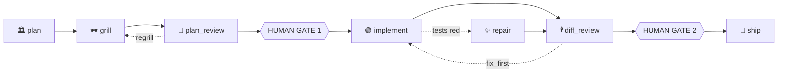

# ⌐■-■ **anderson** ⌐■-■

[](https://github.com/amj-lang/anderson/actions/workflows/ci.yml)
[](https://github.com/amj-lang/anderson/releases)
[](LICENSE)
[](https://github.com/amj-lang/anderson)
[](metrics/traffic.json)
[](metrics/installs.json)


A [Claude Code](https://claude.com/claude-code) plugin that turns one task into one reviewed pull request.

You describe the task. A crew of agents, sized to how hard the task is, plans it, writes it and reviews it. You step in twice: once to approve the plan, once to approve the code. Everything in between runs without you.

## Why use it

- **It gets it right the first time more often.** Before any code is written, you answer the plan's open questions and a second, stronger model reviews it. Mistakes get fixed in the plan, where they are cheap, not in the third rework.
- **You only step in where it matters.** Two gates: the plan and the final diff. You judge intent and results; the agents do the typing.
- **Several tasks at once.** Each task keeps its own state on disk, so you can run many in parallel. `fleet` shows all of them on one screen, tells you which one needs you, and takes you there.
- **Every decision is written down.** The plan, the evidence for each acceptance criterion and both reviews live in one folder per task.

## Philosophy


The job is changing. You will read less code and judge more intent: check the plan and the design, answer the questions a model can't settle on its own, then prove the result by running it and trying it by hand. That work doesn't need an IDE. It needs a terminal.

## Install

```
/plugin marketplace add amj-lang/anderson
/plugin install anderson@dodge-this
# restart Claude Code fully (not just /reload), then:
/anderson:start <slug> "<goal>"
```

Try `/anderson:demo` first: it walks the whole pipeline, every screen and both gates, without spending a token.

Two optional companions make the agents sharper. Without them, the agents fall back to plain text search:

```
/plugin install typescript-lsp@claude-plugins-official   # then: npm i -g typescript-language-server typescript
/plugin install context7@claude-plugins-official         # up-to-date library docs for the agents
```

LSP lets the agents trace exactly what a change touches. For other languages, install the matching `*-lsp` plugin (`pyright-lsp`, `gopls-lsp`, ...).

For the session monitor, run `/anderson:fleet` once, then type `fleet` in any terminal tab.

## How anderson works


```mermaid
flowchart LR
    plan[🏛 plan] --> grill[🕶 grill] --> pr[🔮 plan_review] --> g1{{HUMAN GATE 1}}
    g1 --> impl[🟢 implement] --> dr[🕴 diff_review] --> g2{{HUMAN GATE 2}} --> ship[🔑 ship]
    pr -. regrill .-> grill
    dr -. fix_first .-> impl
    impl -. tests red .-> rep[✨ repair]
    rep --> dr
```

|     | Stage         | Who                      | Model · effort              |
| --- | ------------- | ------------------------ | --------------------------- |
| 🏛  | `plan`        | THE ARCHITECT            | opus · medium               |
| 🕶  | `grill`       | THE INTERROGATOR (you)   | human                       |
| 🔮  | `plan_review` | THE ORACLE               | opus · high\*, then GATE 1  |
| 🟢  | `implement`   | NEO                      | sonnet · medium             |
| ✨  | `repair`      | TRINITY (only when red)  | opus · high                 |
| 🕴  | `diff_review` | AGENT SMITH              | opus · high\*, then GATE 2  |
| 🔑  | `ship`        | THE ONE                  | branch + commit + push + PR |

In plain words:

1. **Plan.** THE ARCHITECT reads the ticket, the design and the code, and writes `plan.md`.
2. **Grill.** You get asked about the plan, one question at a time, until nothing is ambiguous.
3. **Plan review.** THE ORACLE, a stronger model, rewrites the weak parts of the plan. It can send it back to the grill. **Gate 1:** you approve the plan.
4. **Implement.** NEO writes the code and records the evidence for every acceptance criterion. If the tests go red, TRINITY finds the root cause instead of looping NEO (and may never weaken a test to get green).
5. **Diff review.** AGENT SMITH, who didn't write the code, reviews it against the plan. `fix_first` sends it back to NEO, up to `max_iterations`. **Gate 2:** you approve the code.
6. **Ship.** A branch, a commit and a pull request. Never a force-push.

**The crew.** Specialist reviewers join when the change calls for them, picked by what the plan or diff touches (`bin/crew.py`), not by a model's mood: SERAPH for security (auth, APIs, input, secrets, dependencies), NIOBE for performance (queries, loops over I/O, React effects), THE MEROVINGIAN for dead code a diff leaves behind. They review independently; THE ORACLE and AGENT SMITH rule on their findings.

At each gate you get a short card: what changes, how each criterion is proven, the risk scorecard and the verdict. You open the full plan only when something looks off. Both gates always stop.

## auto mode

`/anderson:auto <task-id> <title> [body|@file]` runs the same pipeline without stopping for you and ends at a **draft** PR. Experimental.

Instead of you, three checks guard each gate, in order: CI must be green; then 1 to 3 independent reviewers (more for harder tasks), each on one angle and blind to each other; then an opus arbiter decides on the merits, not by counting votes.

Two rules never bend: auto never writes or runs a database migration, and never force-pushes anything but its own `anderson/auto/*` branch. Details: [docs/auto-mode.md](plugins/anderson/docs/auto-mode.md).

## The paper trail

Everything for one task lives in `feature-research/<task>/`:

```
feature-research/<task>/
├── plan.md            the human-facing artifact
├── state.md           machine state: stage, gate, verdicts, tier
├── audit.md           implementer's evidence, one entry per criterion
├── design/            normalized Figma shots / ticket screenshots / images
│   └── inventory.md   exact strings, states, layout facts
└── report.md          auto mode only, written on abort
```

**`plan.md`** is the one file you read. It goes What → Why → Behavior change → Design → Acceptance criteria → How → Scorecard, with the long parts folded. The heart of it is the acceptance criteria table: each criterion comes from the ticket, the design or the grill, and names how it will be proven (`test` that fails without the change, `visual` against the design, `e2e`, or `manual` as a last resort). The implementer fills in the evidence; the reviewer blocks on any blank.

**`state.md`** is for the machine: stage, gate, iteration, verdicts, tier. It makes a run resumable, and it is what `/anderson:status` and `fleet` read.

Every finished run also adds one line to a local log (`~/.claude/anderson/runs.jsonl`, never sent anywhere); `bin/runlog.py --summary` shows tiers, rework rounds and how often each reviewer was right.

## Difficulty tiers

Not every task deserves the same scrutiny. The planner scores each plan on risk, coupling, confidence and testability, which gives a tier: trivial, normal, hard or critical. The tier is checked again against the real diff and can only go up, so a one-line fix never pays for a three-reviewer panel, and a risky change never slips through on a light one.

| Tier     | Plan review   | Diff review   | auto panel        |
| -------- | ------------- | ------------- | ----------------- |
| trivial  | opus · high   | opus · high   | 1 × sonnet · high |
| normal   | opus · high   | opus · high   | 2 × sonnet · high |
| hard     | opus · high   | opus · xhigh  | 3 × opus · high   |
| critical | opus · xhigh  | opus · xhigh  | 3 × opus · high   |

\* The plan review always runs a step above the planner. Crew seats run opus · high for security, and opus · medium (high from HARD up) for performance and dead code.

**Why Opus, not Fable, for the reviews.** Until 0.52 both gates ran on Fable. Opus 5.5 beat Fable 5.1 on every benchmark Anthropic published at launch, at 2.5× less per token, so since 0.53 every review seat runs on Opus. There is no public head-to-head on code review itself, but a model that only matched Fable at 40% of the price would still win the seat. Tables and history: [docs/tiering.md](plugins/anderson/docs/tiering.md).

## Fleet: every Claude session on one screen


Once you run more than one agent, the hard part is keeping track: which one is waiting on you, what each is doing, where its tab went. `fleet` answers that from one terminal tab. It runs outside Claude, so it costs no tokens.

- **What every agent is doing.** One row per live Claude Code session, across all your repos: its title, its pipeline stage if it runs anderson, what it is doing right now (`▶ Bash pytest -q`), how full its context is.
- **Who needs you.** A session rings when it is really waiting on you: its turn is done, it asks permission, or it asks a question. It rings once, with a sound if you want one, and stays quiet while you are already looking at it. Ringing sessions sort to the top.
- **Go there.** `⏎` brings that session's tab to the front, in Ghostty, iTerm2, Terminal.app, tmux or your IDE. A dead session reopens in a new tab, resumed. `fleet --focus` brings fleet back; bind it to a hotkey.
- **Start the next one.** Below the sessions sit your workspace's repos. Pick one, press `N`, type the task, and a new agent starts in its own tab and gets selected as soon as it appears. A repo with work in progress on a feature branch gets a separate worktree, so nothing of yours is touched.

| Key          | Does                                                                 |
| ------------ | -------------------------------------------------------------------- |
| `⏎`, `1`-`9` | go to that session's tab; on a dead one, resume it in a new tab      |
| `N`          | start a new agent in a repo (plain, `/anderson:start` or `/anderson:auto`) |
| `w`          | jump to the session that has waited longest                          |
| `o`          | read the plan, audit and diff right there                            |
| `r` / `b`    | kill a session (asks first) / hide a row                             |
| `space`      | fold the repo list, or the `dead` line                               |
| `m`          | ring sound on/off                                                    |
| `/`, `?`     | filter, manual                                                       |

Sessions you closed, and ones dead for over an hour, fold into one `dead` line so they stay out of the way.

```
/anderson:fleet      # once: installs ~/.local/bin/fleet
fleet                # runs right here, in this tab
fleet --focus        # bring the running fleet back to the front
fleet --notify       # desktop banners too; clicking one takes you to that session
```

Needs nothing but python3. `glow`, `terminal-notifier` and `tmux` are optional. Flags and data sources: [plugins/anderson/README.md → Extras](plugins/anderson/README.md#extras-terminal).

## Commands

| Command        | Does                                                              |
| -------------- | ----------------------------------------------------------------- |
| `start`        | Plan, grill you, plan-review. Halts at Gate 1.                    |
| `approve-plan` | Implement, then independent diff review. Halts at Gate 2.         |
| `approve-diff` | Ship: branch, commit, push, PR. Never force-pushes.               |
| `rework`       | Loop the implementer on the blockers, re-review. Back to Gate 2.  |
| `status`       | Where a run is: stage, next agent, verdicts, iteration.           |
| `demo`         | Zero-token dry run of every banner and both gates.                |
| `auto`         | Non-halting pipeline to a draft PR. Experimental.                 |
| `help`         | Quick-reference card. Reads nothing.                              |
| `fleet`        | Install the `fleet` terminal command.                             |

Commands are namespaced `/anderson:<command>`. The first word is the task's slug, which names its folder. Once a run is going you can also just say "approved, go", "ship it" or "rework the blockers".

## Requirements

- Claude Code with plugin support.
- For ship: `git`, a remote, and an authenticated [`gh`](https://cli.github.com). Degrades gracefully without them.
- Optional, used when present: the LSP and context7 plugins above; `npm audit`, `gitleaks` and `semgrep` for SERAPH; `knip` for THE MEROVINGIAN.

## More

- Full operator docs: [plugins/anderson/README.md](plugins/anderson/README.md)
- auto-mode spec: [plugins/anderson/docs/auto-mode.md](plugins/anderson/docs/auto-mode.md)
- Headless / CI runner: [plugins/anderson/bin/feature.sh](plugins/anderson/bin/feature.sh) exits 10 at Gate 1 and 20 at Gate 2, so it composes with CI or a Makefile
- Promo video source and README images: the [`media`](https://github.com/amj-lang/anderson/tree/media) branch (`git switch media`). Off `main` so installing the plugin does not download them.
- CI workflow: [.github/workflows/ci.yml](.github/workflows/ci.yml)
- Install counting, and how to switch it off: [plugins/anderson/README.md#install-counting](plugins/anderson/README.md#install-counting)
- [MIT licence](LICENSE)
